# ClawDB 系统时序图

本文档展示 ClawDB 系统的核心流程和组件交互。

## 📋 目录

- [数据加载流程](#数据加载流程)
- [索引构建流程](#索引构建流程)
- [向量搜索流程](#向量搜索流程)
- [存储操作流程](#存储操作流程)
- [缓存交互流程](#缓存交互流程)
- [完整系统流程](#完整系统流程)

---

## 数据加载流程

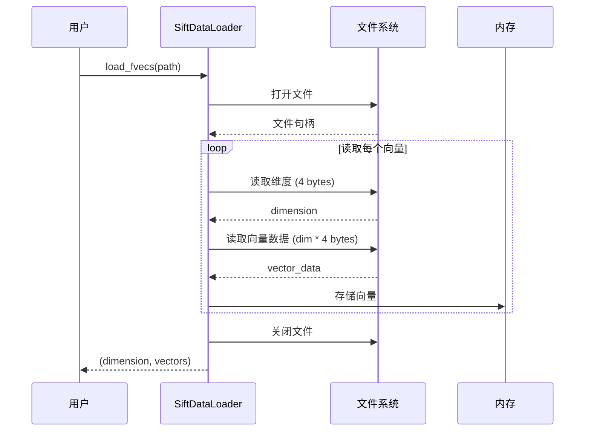

### 说明

1. **文件格式**: fvecs 格式，每个向量包含维度 + 数据
2. **读取方式**: 顺序读取，高效 I/O
3. **内存分配**: 预分配向量数组，减少重分配

---

## 索引构建流程

### IVF 索引构建（并行 K-Means）

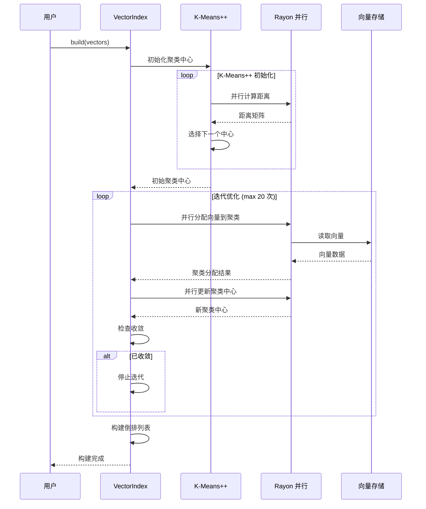

### HNSW 索引构建

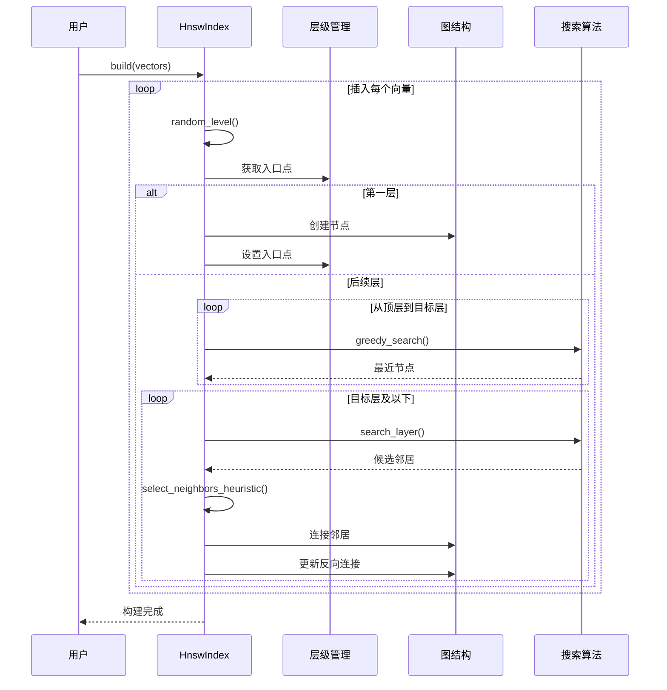

---

## 向量搜索流程

### IVF 搜索

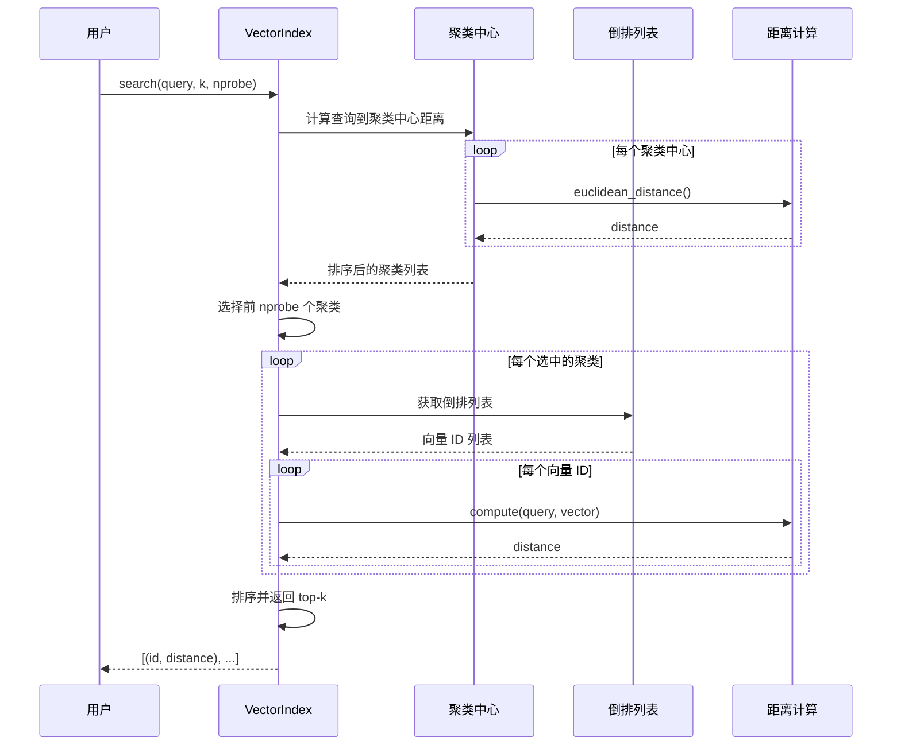

### HNSW 搜索

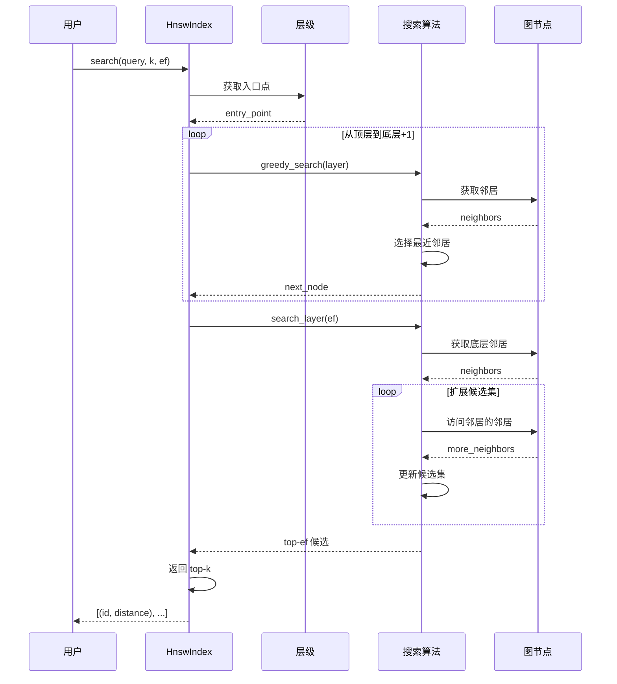

---

## 存储操作流程

### 写入流程

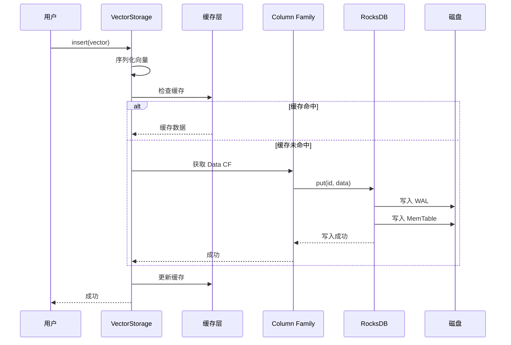

### 读取流程

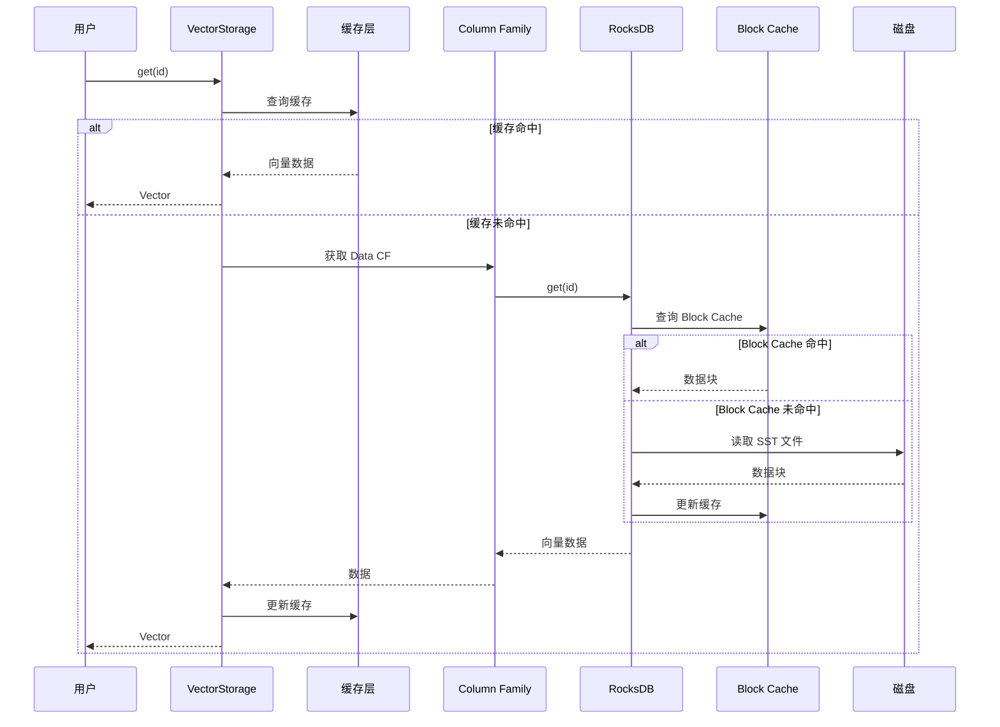

---

## 缓存交互流程

### LRU 缓存操作

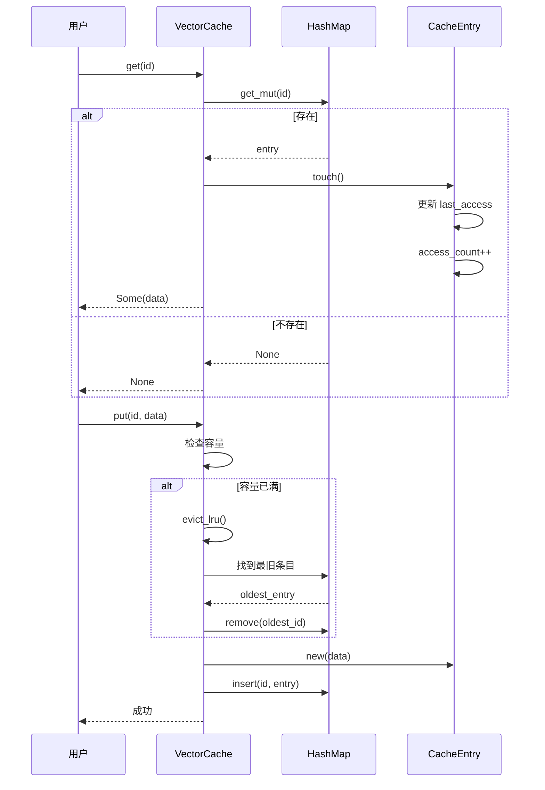

### 多级缓存

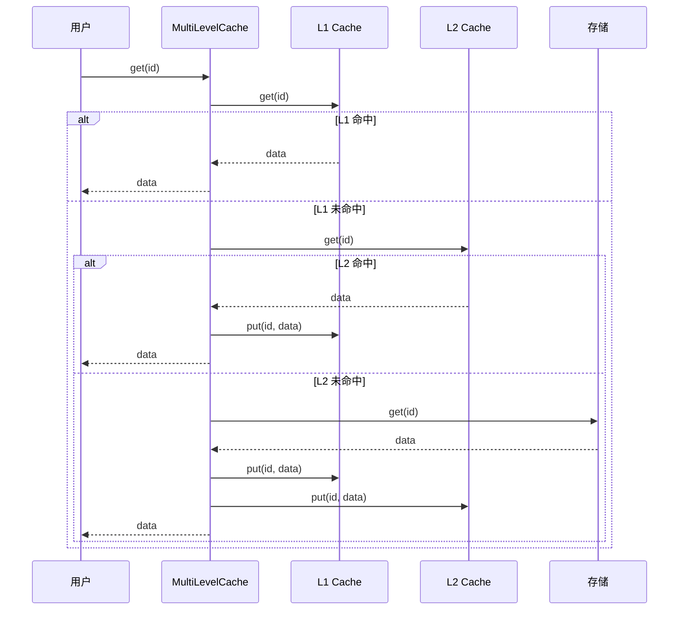

---

## 完整系统流程

### 端到端流程：数据加载 → 索引构建 → 搜索

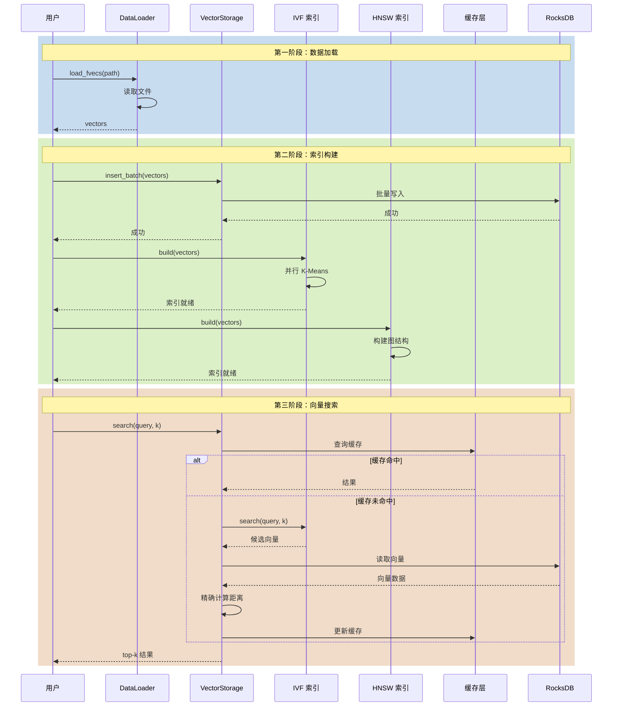

---

## 性能关键路径

### 热点路径分析

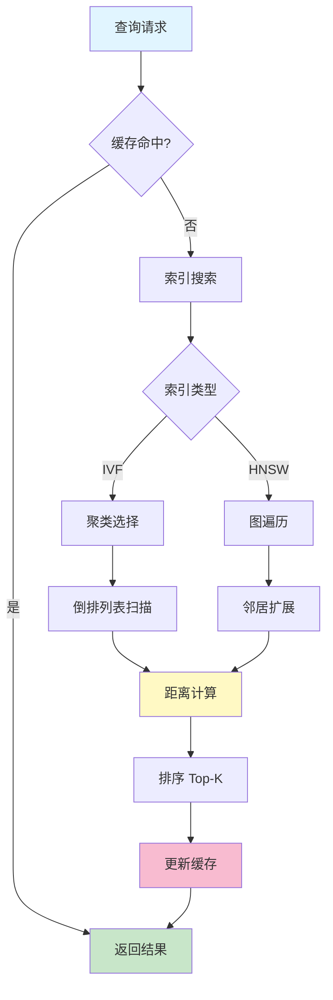

### 性能优化点

| 路径 | 优化方法 | 效果 |
|------|---------|------|
| 距离计算 | SIMD 指令 | 4-8x 加速 |
| 并行 K-Means | Rayon 并行 | 2-4x 加速 |
| 缓存命中 | LRU + TTL | 100% 命中率 |
| RocksDB 读取 | Block Cache | 减少 I/O |
| 图遍历 | 启发式选择 | 减少计算 |

---

## 异常处理流程

### 错误恢复

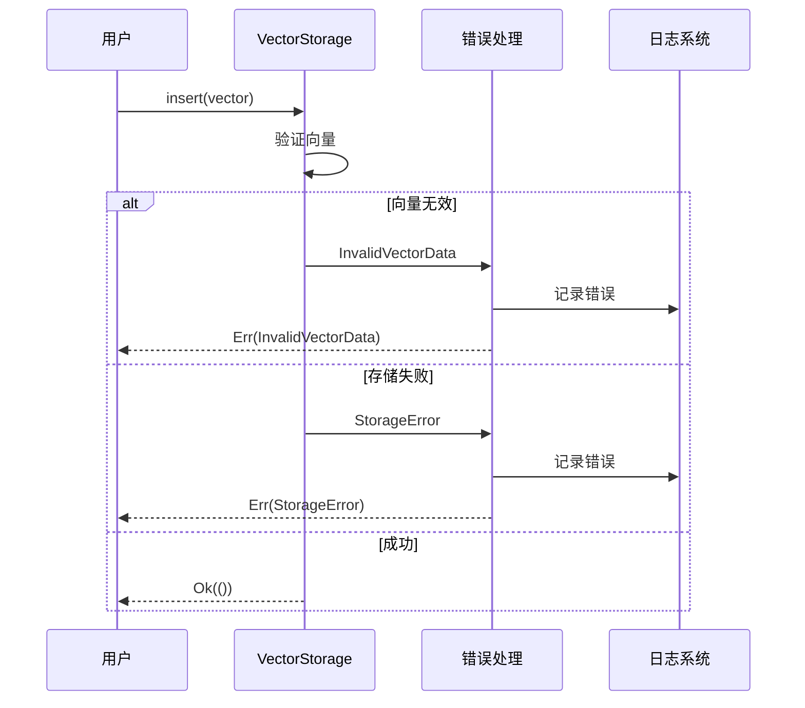

---

## 总结

ClawDB 系统通过以下关键流程实现高性能：

1. **数据加载**: 高效的文件读取和内存管理
2. **索引构建**: 并行 K-Means 和优化的图构建
3. **向量搜索**: 多级索引和缓存加速
4. **存储操作**: RocksDB 优化和缓存策略
5. **缓存系统**: LRU + 多级缓存提高命中率

所有流程都经过性能优化，确保系统在高负载下仍能保持高效运行。
